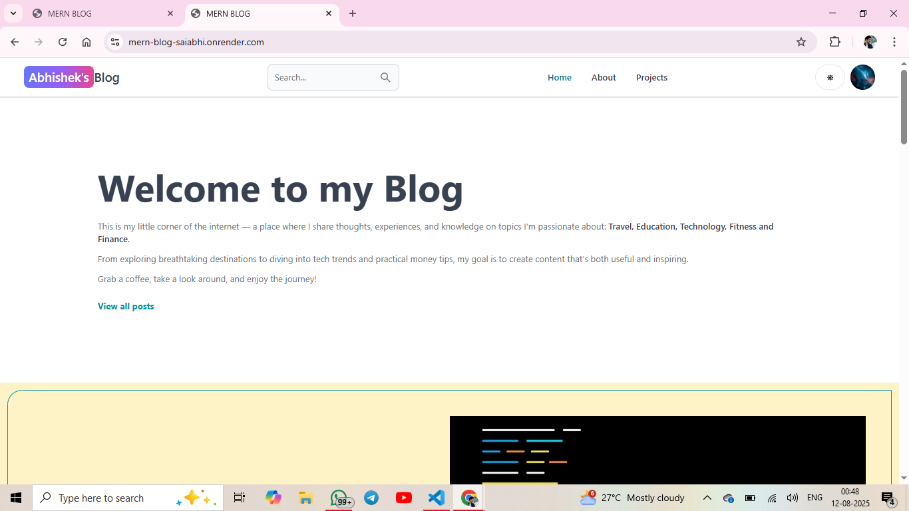
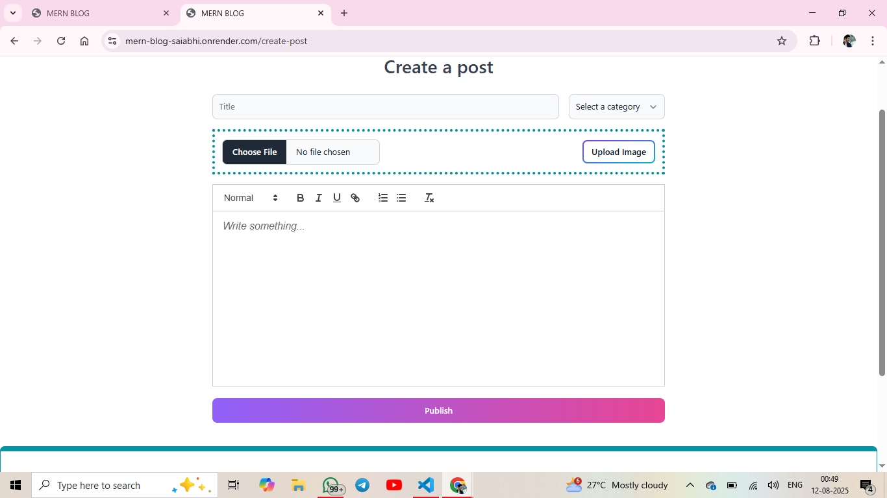
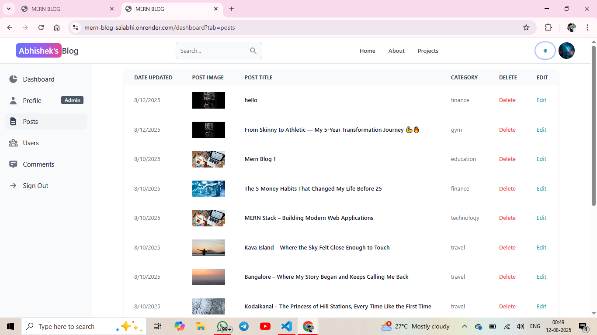
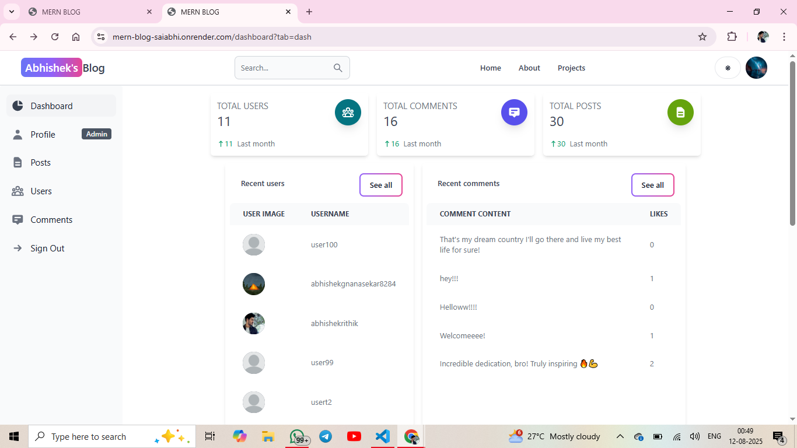
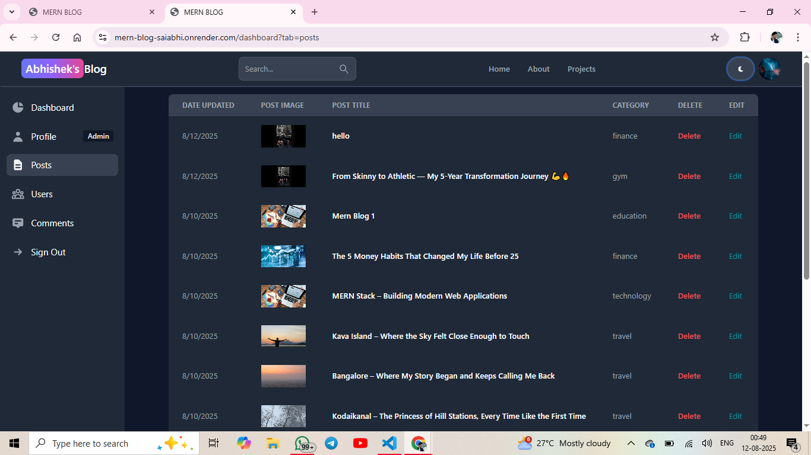

# 📝 MERN Blog Website

A fully functional blog application built with the **MERN Stack** (MongoDB, Express.js, React.js, Node.js) featuring authentication, CRUD operations, image upload, and dark mode support.

---

## 🌐 Live Demo

You can check out the live deployed version of the project here:  
[**MERN Blog App**](https://mern-blog-saiabhi.onrender.com/)

---

**Features:**

- Fully Responsive Design
- CRUD Operations (Posts, Comments, Users)
- Admin Dashboard with Role-Based Access
- Advanced Search & Filtering with MongoDB Queries
- Image Upload Functionality
- Comment Like, Edit, and Delete System
- Secure Routes (Private Pages)

---

## 📸 Screenshots

### 🏠 Home Page



### 🖊️ Create Post Page



### 📄 Post Page



### 📊 Dashboard



### 🌙 Dark Mode



---

## 🛠️ Tech Stack

**Frontend:**

- React.js (Latest version)
- Tailwind CSS
- React Router DOM
- Redux Toolkit & Redux Persist
- Dark Mode with Tailwind
- Google OAuth Integration

**Backend:**

- Node.js
- Express.js
- MongoDB & Mongoose
- JSON Web Tokens (JWT) Authentication
- Middleware for Error Handling

  **Core Features:**

- Fully responsive UI
- CRUD operations (Posts, Comments, Users)
- Admin dashboard with role-based access
- Advanced search & filtering with MongoDB queries
- Image upload functionality
- Comment like, edit, and delete system
- Secure routes (Private Pages)

  **Deployment:**

- Render (Free Hosting for Full Stack)

---

## 📂 Project Structure

```bash
project/
│
├── client/                # React (Vite) frontend
│   ├── src/
│   ├── public/
│   └── package.json
│
├── api/                   # Backend API
│   ├── controllers/
│   ├── models/
│   ├── routes/
│   ├── utils/
│   └── server.js
│
├── .env                   # Environment variables
├── README.md
└── package.json
---
```

## 📬 Contact

**Abhishek Gnanasekar**
📧 **Email:** [abhishekgsts25@gmail.com](mailto:abhishekgsts25@gmail.com)
💻 **GitHub:** [abhishekrithik](https://github.com/abhishekrithik)
💼 **LinkedIn:** [Abhishek Gnanasekar](https://www.linkedin.com/in/abhishek-gnanasekar/)

## ⭐ If you like this project, don't forget to star the repo on GitHub!

```

```
